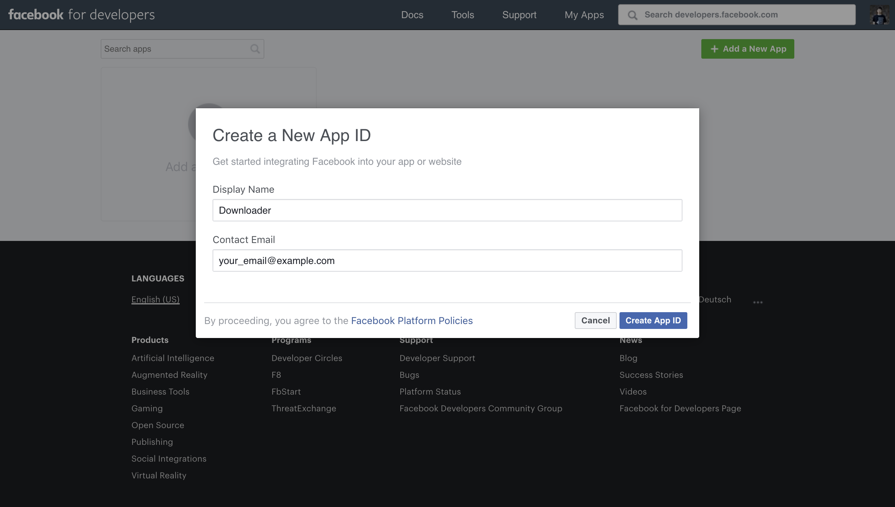

## Create Facebook app

**1.** Go to https://developers.facebook.com/apps/ and create new app

**2.** Hit to [Set up] on [Facebook Login] box

Enter `[Valid OAuth Redirect URIs]`: `https://0.0.0.0:8443`, `https://localhost:8443`

**3.** Go to [Settings ❯ Basic] to input App's domains: `0.0.0.0`, `localhost`

**Optional.** Go to [Roles ❯ Roles] to add Tester (Add the Facebook account that you want to allow use this application)

